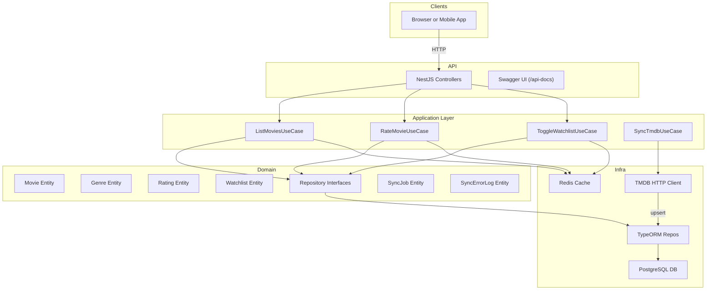

# TMDB Movie Catalog API

A NestJS-based CRUD application that syncs data from The Movie Database (TMDB) and exposes RESTful endpoints for listing, searching, filtering, rating, and managing a watchlist. Built with PostgreSQL, Redis caching, Docker, and Swagger documentation.

## 🚀 Features

- **Data Sync**  
  - Periodic (cron) upsert of "popular" movies & genres from TMDB  
  - **Sync & Failure Tracking**: each sync run records status (`PENDING`, `IN_PROGRESS`, `FAILED`, `COMPLETED`), error type (`NETWORK`, `PROVIDER`, `UNKNOWN`), HTTP/status codes, and messages.  
- **Movie Endpoints**  
  - List & paginate (`GET /movies?page=1&limit=20&search=matrix&genre=Action`)  
  - Get details (`GET /movies/:id`)  
- **Ratings**  
  - Rate a movie (`POST /movies/:id/rate { score: 1–5 }`)  
  - Returns updated average rating  
- **Watchlist**  
  - Toggle favorite (`POST /users/:id/watchlist { movieId: 123 }`)  
  - Get user's watchlist (`GET /users/:id/watchlist`)  
- **Filtering & Search**  
  - Filter by genre, search by title  
- **Caching**  
  - Redis cache for hot endpoints (list, details) with automatic invalidation  
- **API Documentation**  
  - Swagger UI at `/api-docs`  
- **Testing**  
  - Jest unit tests & Supertest integration tests (≥ 85% coverage)  
- **Containerization**  
  - Docker & Docker Compose for easy local setup  

## 🏗 High-Level Architecture



## 📦 Prerequisites

- Node.js (v16 or later)
- npm or yarn
- Redis server
- PostgreSQL database
- TMDB API key
- Docker (optional)

## ⚙️ Environment Variables

Create a `.env` file in the root directory with the following variables:

```env
# Database
DB_HOST=localhost
DB_PORT=5432
DB_USERNAME=postgres
DB_PASSWORD=your_password
DB_DATABASE=tmdb_api

# Redis
REDIS_HOST=localhost
REDIS_PORT=6379
REDIS_PASSWORD=your_password
REDIS_DB=0

# TMDB
TMDB_API_KEY=your_tmdb_api_key

# JWT
JWT_SECRET=your_jwt_secret
JWT_EXPIRATION=1d

# Rate Limiting
THROTTLE_TTL=60
THROTTLE_LIMIT=10
```

## 🚀 Installation

1. Clone the repository:
```bash
git clone https://github.com/anaskhafegui/tmdb-nestjs-api.git
cd tmdb-nestjs-api
```

2. Install dependencies:
```bash
npm install
```

3. Start the development server:
```bash
npm run start:dev
```

Or using Docker:
```bash
docker-compose up -d
```

Run migration:
```bash
npm run migration:run
```

## 🧪 Development & Testing

- Run tests: `npm run test`
- Run tests with coverage: `npm run test:cov`
- Lint code: `npm run lint`
- Format code: `npm run format`

## 📚 API Documentation

Swagger UI is available at:  
📍 `http://localhost:9000/api-docs`

## 📝 License

This project is licensed under the MIT License — see the [LICENSE](LICENSE) file for details.
